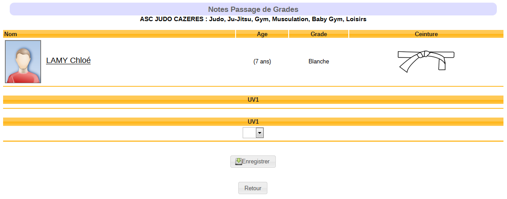
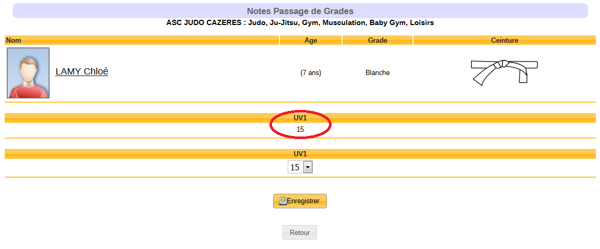
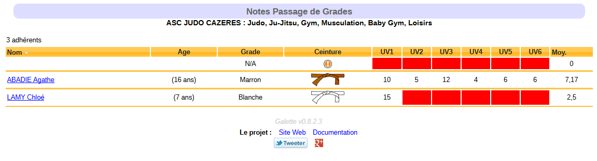

## Galette plugin Passage de grades

Galette Passage de grades est un plugin réalisé pour Galette.

Ce plugin a pour vocation de permettre d'attribuer des notes aux adhérents, dans le cadre d'une évaluation, comprenant 6 épreuves.

Les résultats sont centralisés dans un tableau récapitulatif. Et un export en CSV, de ce tableau, est possible pour un traitement externe des données collectées.

## Utilisation

Dans l'organisation de notre assiciation, nous utilisons ce plugin conjointement avec le [plugin QRCodes](https://galette-community.github.io/plugin-qrcodes/). Le QRCode est imprimé sur la carte de l'adhérent, ce qui nous permet un accès facile à sa fiche afin d'enregistrer son évaluation.

Bien entendu, l'utilisation du plugin QRCodes est totalement facultative :)

### Attribution des notes

Depuis la fiche adhérent, cliquez sur le bouton « Notes » pour accéder à l'interface de saisie.

Vous êtes redirigés sur la fiche d’attribution de notes, de l’adhérent évalué et de votre table UV.

Attribuez votre note, enregistrez et vérifiez que la note est celle que vous venez d’attribuer.

Cliquez sur retour.

Voici le tableau récapitulatif.

